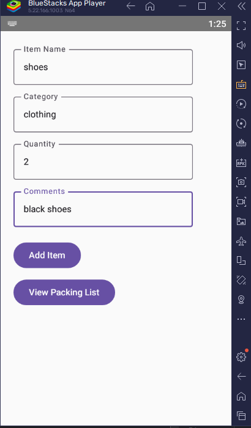
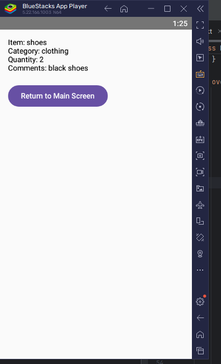

# Travel Packing App

## Student Information
- Name: Koketso Matshetela
- Module: IMAD5112
- Assessment: Practicum Guide

## Purpose of the App
The Travel Packing App helps users create a simple packing list for a trip. Users can enter the item name, category, quantity, and comments. The information is saved and displayed on a second screen.

## Features
- Add packing items.
- Validate input fields.
- Store data using parallel arrays.
- View the packing list on a second screen.
- Return to the main screen.
- Display Toast messages for validation.

## Kotlin Concepts Used
- Parallel arrays
- Mutable state (`remember` and `mutableStateOf`)
- `OutlinedTextField`
- `Button`
- `Column`
- `Spacer`
- `Intent`
- `Toast`
- `finish()`

## Sample Data
| Item | Category | Quantity | Comments |
|------|----------|----------|----------|
| Shoes | Clothing | 2 | Black shoes |
| Toothbrush | Toiletries | 1 | Essential for hygiene |
| Passport | Documents | 1 | Do not forget |

## Screenshots

### Screen 1
 
### Screen 2
 

### Main Screen
The main screen allows the user to:
- Enter item details.
- Add items to the packing list.
- View the packing list.

### Packing List Screen
The second screen displays:
- Item name
- Category
- Quantity
- Comments

It also includes a **Return to Main Screen** button.

## Error Handling
If any field is left blank, the app displays:
`Please fill all fields`

## Challenges Faced
I initially struggled with passing data between MainActivity and SecondActivity using Intent extras. After correcting the keys and testing the app, the data displayed correctly.

## GitHub Repository Link
https://github.com/YourUsername/TravelPackingApp

## How to Run the App
1. Clone the repository.
2. Open the project in Android Studio.
3. Run the app on an emulator or Android device.
